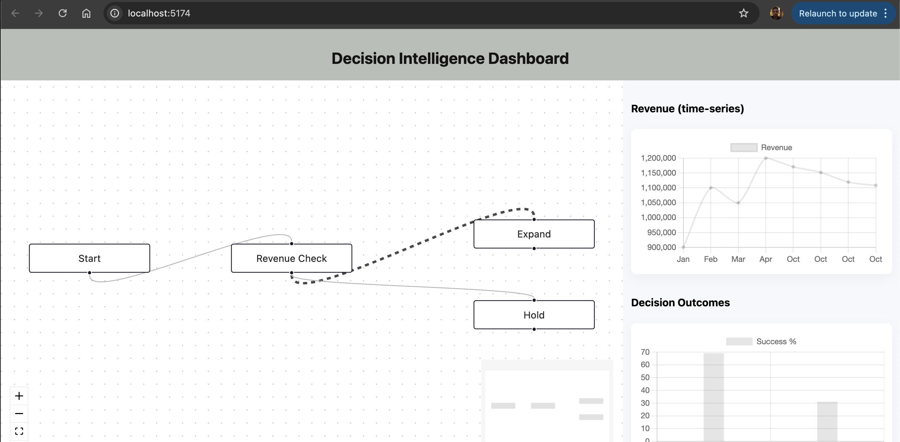

# Architecture & Important decisions (brief).

## 1. State management (Redux Toolkit slices)

a. workflow slice: stores nodes, edges and activePath.

b. data slice: stores revenue time series, lastValue, and decision outcome distribution.

c. Note:- Using Redux allows multiple components to read workflow & data and makes it easy to persist/load the workflow to/from backend later.

## 2. ReactFlow

a. I have used useNodesState and useEdgesState for local node/edge convenience (dragging, internal state)
and  sync local ReactFlow state back to Redux (setNodes, setEdges) using useEffect so the canonical data is in Redux — beneficial for persistence, multi-component reads.

## 3. Conditional logic

a. Edges can have data.rule (string). When a connection is made, user is prompted to input a rule (e.g. revenue > 1000000). The evaluator checks each edge rule against context = { revenue: lastValue }.

b. If an edge evaluates to true, we add it to activePath and visually highlight it (animated & thicker stroke).

## 4. Charts & real-time

a. useMockData uses setInterval to simulate incoming revenue and outcome updates.

b. Chart components use react-chartjs-2 (Chart.js 4) and React.memo for render optimization.

Redux selectors return only the slices charts need to reduce re-renders.

## 5. Performance

a. I have used React.memo for Charts, minimal selectors in useSelector, styled edges computed once per render.

b. For large workflows, I may have to consider memoizing evaluation and debouncing frequent updates. this is for future enhancement.

##  6. Security & evaluation

a. I used new Function(...) in evaluateRule for simplicity. 
Production: I need to replace with an expression parser (e.g., expr-eval or jsep) to avoid arbitrary code execution and to provide a strictly-typed expression language.

# 5-minute demo script 

a. Used Vite to set up my React App (DECISION-INTELLIGENCE-DASHBOARD) AND REACT VERSION IS 19.1.1

b. To start dev server, please run "npm run dev" and open http://localhost:5173.

c. Left side showing the workflow editor (drag nodes, reposition).

d. Right side showing the  Charts auto-updating (revenue timeseries + decision outcome bar).

e. You can create a new connection from the Revenue Check node to Expand (or any node). When prompted, set rule revenue > 1000000.

f. Pleaase watch the revenue chart; while the mock feed crosses 1,000,000 the connection highlighting toggles (active path).

|Start Node| ---- |Revenue Check Node|  ----- ( If revenue > $1M) -- then --- |Trigger Expansion Node| else ----- | Hold |

